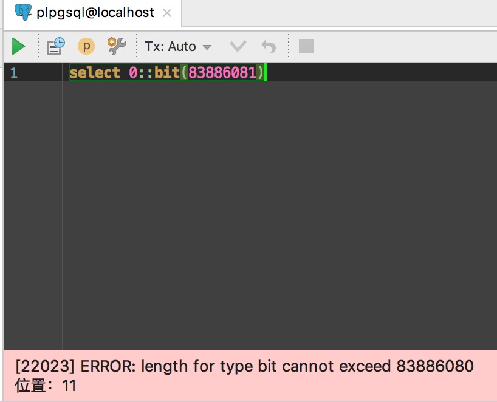
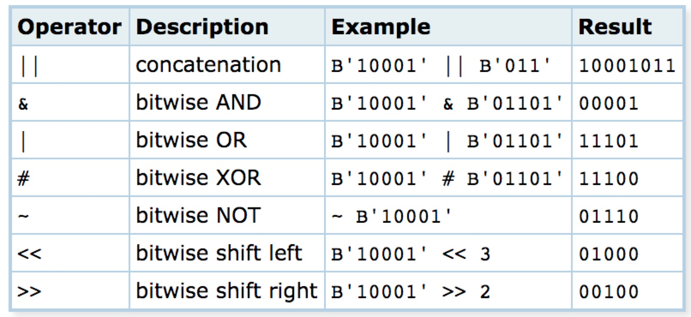
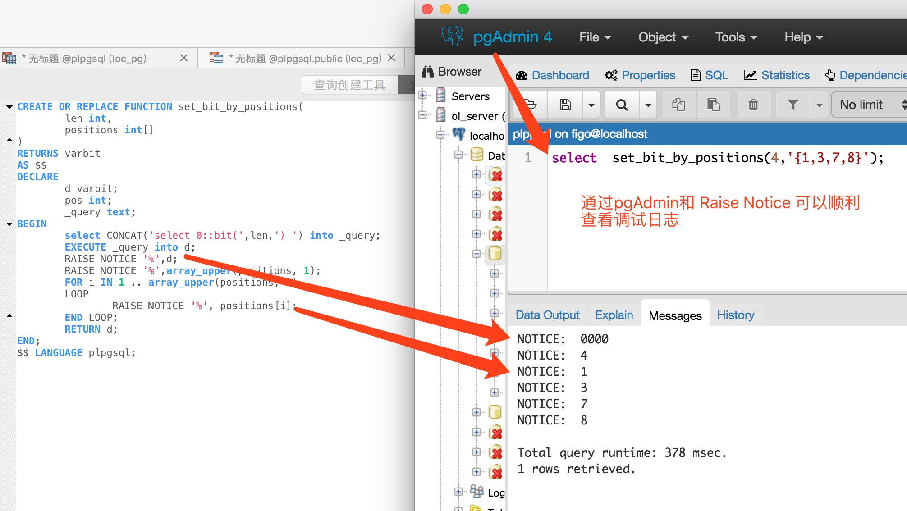

# plpgsql Bit String操作
* [返回](../README.md)
* [将bitString转换成int array](convertBitString2IntArray.sql)
* [将int array转换成bitString](convertIntArray2BitString.sql)

# Bit String的最大长度限制
* Bit String 最大长度为 83886080
* 8KW的时候,体积为80MB

# 操作符
* https://www.postgresql.org/docs/8.2/static/functions-bitstring.html
* https://www.postgresql.org/docs/9.5/static/functions-bitstring.html

# 调试日志查看
* RAISE NOTICE 'HELLO'
* RAISE NOTICE '%', positions[i];

# PG里的函数调用
https://blog.csdn.net/luojinbai/article/details/46285239